# US Presidents

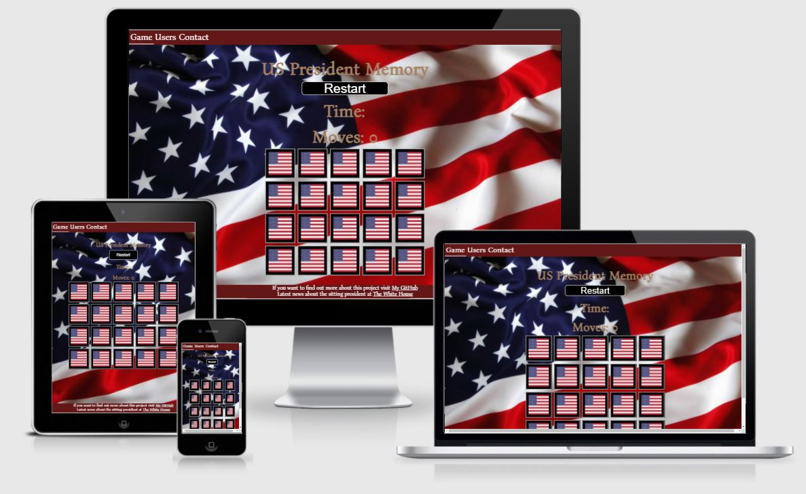

## Welcome to my site [US President Memory](https://charlie9009.github.io/CI_PP2_UPM/index.html)!

 

<!-- markdown-toc start - Don't edit this section. Run M-x markdown-toc-
refresh-toc -->

# Table of Content

1. [Project goals](#project-goals)

2. [User experience](#user-experience)

    1. [Target audience](#target-audience)

    2. [User stories](#user-stories)

    3. [Design](#design)

    4. [Wireframes](#wireframes)

3. [Features](#features)

4. [Technologies used](#technologies-used)

    1. [Languages](#languages)

    2. [Libraries and programs](#libraries-and-programs)

5. [Testing](#testing)

    1. [HTML](#html)

    2. [CSS](#css)

    3. [Accessibility](#accessibility)

    4. [Performance](#Performance)

    5. [Further testing](#further-testing)

    6. [Testing user stories](#testing-user-stories)

6. [Bugs](#bugs)

7. [Deployment](#deployment)

8. [Credit](#credit)

    1. [Media credit](#media-credit)

    2. [Acknowledgement](#acknowledgement)

## Project goals

* The goal of this project is to challenge my own knowledge to make a fun and challenging game for users.

## User experience

### Target audience

The site is targeted towards everyone who wants to challenge their
themselves.

### User stories

1. As a user I want an easy website where I can find the game fast.

2. As a user I want to be able to see which page I am on.

3. As a user I want to be able to play on desktop, tablet and mobile devices.

4. As a user I want to challenge my brain.

5. As a user I want to see how much time has passed in real-time while playing.

6. As a user I want to be able to see the amount of moves I have made.

7. As a user I want to see a pop up modal with time expired and moves made when completing the game.

8. As a user I want to be able to drop my info for updates.

9. As a user I want to see other user who have played the game.

10. As a user I want to know the site owners process making the site.

11. As a user I want to see the latest updates from the White House.

12. As a user I want a reset button if I want to reset the game.

13. As a user I want a validation if my form was sent or if there was an error.

#### Site owner goals

14. I want the site to be visually appeasing.

15. I want the user to be able to challenge themselves.

16. I want the user to have fun.

### Design

* Because my site was going to focus on a game with American presidents I wanted to have a design with an American touch to it.
Therefor I chose the US flag for my background as well as the background for my game cards.

#### Colors

* Most of the colors I went with were based on the American flag. So there are alot of red and white throughout the site.

* I gave the restart button a black background to make it stick out a bit more so it would be easier to spot.

#### Fonts

* I used Google Fonts and I went with the font Bona Nova because I like how it runs and looks throughout the site. For the backup I picked Sans-serif.

### Wireframes

* Below you can see the images of the wireframes.

The index/Game page.

The congratulations modal.

The Users page.

The Contact page.

## Features

* **The navigation bar and footer**

* The navigation bar and the footer are present on all pages and are responsive. The navigation bar shows links to Game, Users and
Contact. There is a feature of a border bottom to show up underneath the respective link to the page the user is on.
This will help the user identify witch page they are on.

* The footer contains a link to my github page if the user wants to know more about the project. It also contains a link to the White House homepage if the user wants to read about the latest news regarding the White House.
 

 

### User stories covered by this feature:

1. As a user I want an easy website where I can find the game fast.
2. As a user I want to be able to see which page I am on.
10. As a user I want to know the site owners process making the site.
11. As a user I want to see the latest updates from the White House.

* **Info area**

* Here is the h1 header to tell the user they are on the “US president memory” page.

* There is also a timer feature for the game as well as a move counter.
 

### User stories covered by feature:

5. As a user I want to see how much time has passed in real-time while playing.
6. As a user I want to be able to see the amount of moves I have made.
12. As a user I want a reset button if I want to reset the game.

* **Game area**

* The game area features the memory game. The game contains 20 cards with 10 presidents. The game’s goal is to pair together 2 cards with the same image (president), the game is over when all the cards have been paired together.
 
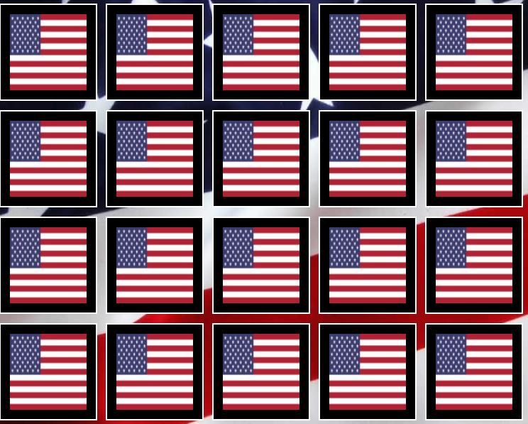

### User stories covered by feature:

1. As a user I want an easy website where I can find the game fast.
3. As a user I want to be able to play on desktop, tablet and mobile devices.
4. As a user I want to challenge my brain.

* **Congratulations Modal**

* When a user completes the game a modal shows up to congratulate the user the game is over along with the final time and how many moves were done ass well as a reset button if the user wants to play again.
 

### User stories covered by feature:

5. As a user I want to see how much time has passed in real-time while playing.
6. As a user I want to be able to see the amount of moves I have made.
7. As a user I want to see a pop up modal with time expired and moves made when completing the game.
12. As a user I want a reset button if I want to reset the game.

* **User page**

* On the user page A fetch function was used to get data to post some users on the page.
 
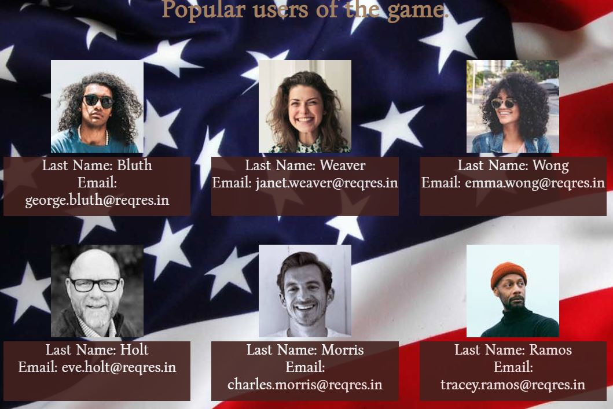

### User stories covered by feature:

9. As a user I want to see other user who have played the game.

* **Contact page**

* On the Contact page there is a form where a user can fill out their name and email if they would like to get updates. EmailJS has been used to send this data to the site owners email.
 
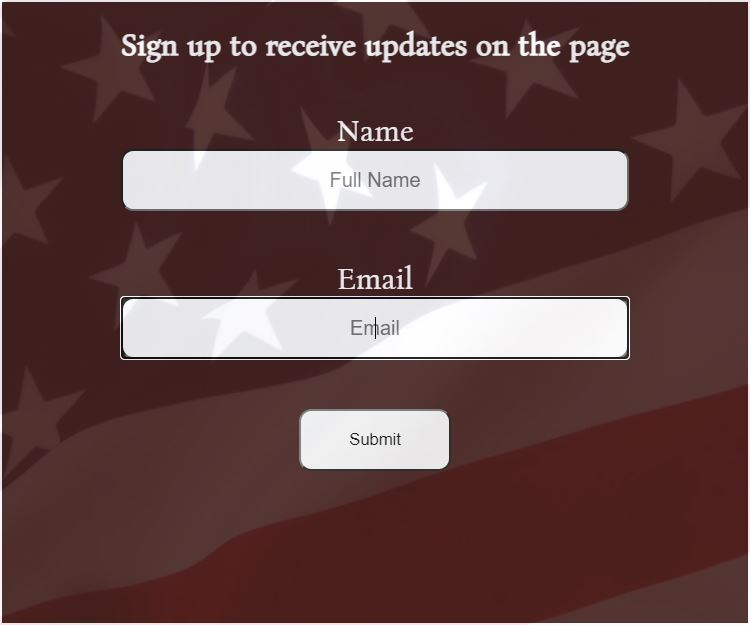

### User stories covered by feature:

8. As a user I want to be able to drop my info for updates.

* **Form Validation**

* In the form there is a form validator to make sure the name or email fields are not empty. There is also a validator to ensure the user the form has been sent successfully.
 
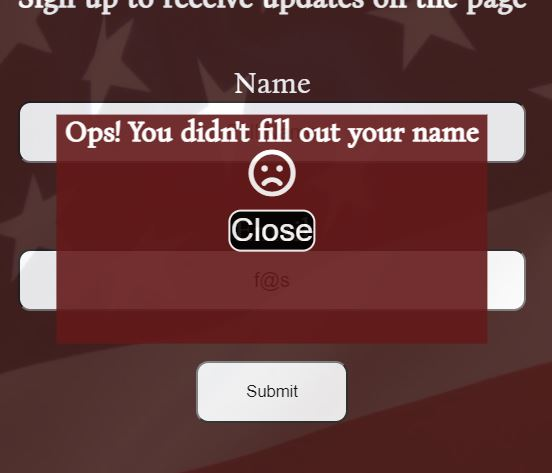

### User stories covered by feature:

13. As a user I want a validation if my form was sent or if there was an error.

### Features left to implement

## Technologies used

### Languages

* HTML

* CSS

* JAVASCRIPT

## Libraries and programs

* EmailJS was used so the filled out forms are being sent to the site owner.

* Virtual Studio Code was used to write the code.

* The Git Bash terminal within VS Code was used to commit and push to Github.

* Github is used to store the code.

* Balsamiq was used to create the project wireframes.

* WC3 Validator, Jigsaw W3 Validator, JShint, Wave Validator, Lighthouse and ami.responsivedesign were all used to test the website.

## Testing

### Validator testing

#### HTML

No errors were found on index.html when passing through WC3 Validator.

No errors were found on users.html when passing through WC3 Validator.

No errors were found on contact.html when passing through WC3 Validator.

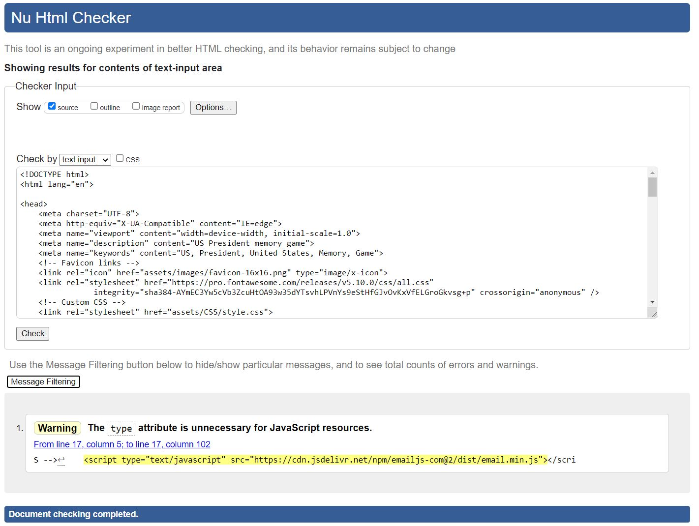

#### CSS

No errors were found on the CSS file when passing through Jigsaw W3 Validator.

#### JavaScript

No errors were found on game.js when passing through jshint.

No errors were found on users.js when passing through jshint.

No errors were found on form.js when passing through jshint.

#### Accessibility

No errors were found on the index.html when passing through Wave Web Accessibility Validator.

No errors were found on the users.html when passing through Wave Web Accessibility Validator.

No errors were found on the contact.html when passing through Wave Web Accessibility Validator.

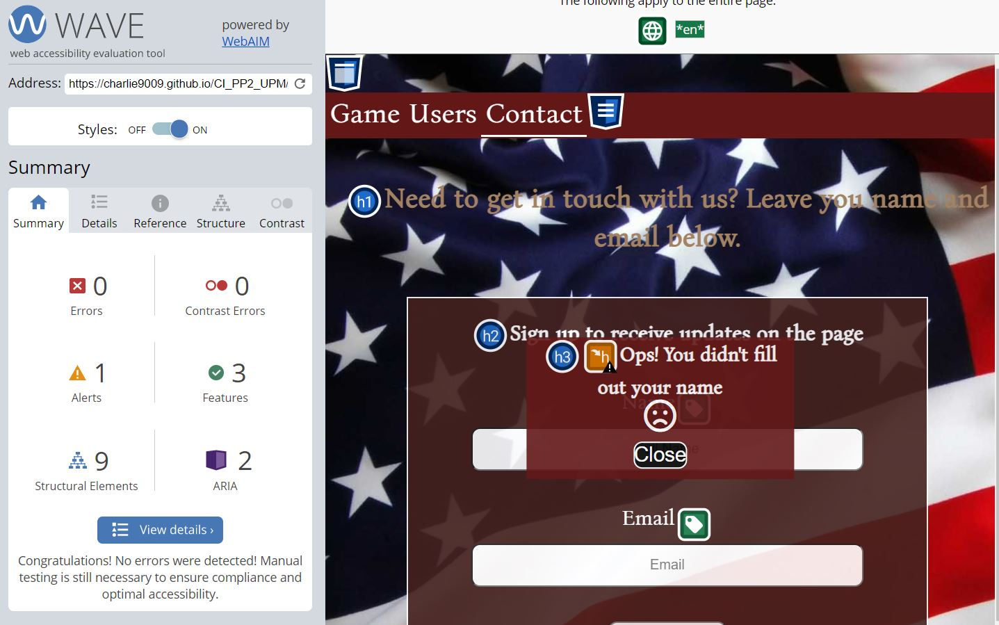

#### Performance

* Lighthouse was used to test the performance and the speed of the site.  

index.html

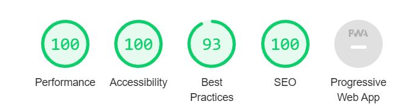

users.html

contact.html

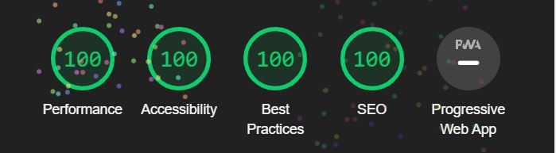

## Further testing

* The website has been tested and are compatible in browsers Chrome, Firefox, Edge.

* I have tested the website thru phones like One Plus 8T and Iphone XR.

* The site has been tested on numerous of computers and laptops.

* Friends and family has been asked to review the site.

## Testing user stories

1. As a user I want an easy website where I can find the game fast.

|                   Feature                       |        Action        |                 Expected result                          |   Actual result     |
|            :----------:                         |    :------------:    |               :-----------------:                        | :---------------:   |
|    The game is on the Home page.                |        None          |      I will find the game when I land on the Home page.  | Works as expected.  |
|   There is a Game link in the navigation bar.   |   Click Game link.   |   I will find the game when I click on the game link.      |  Works as expected. |

Screenshot

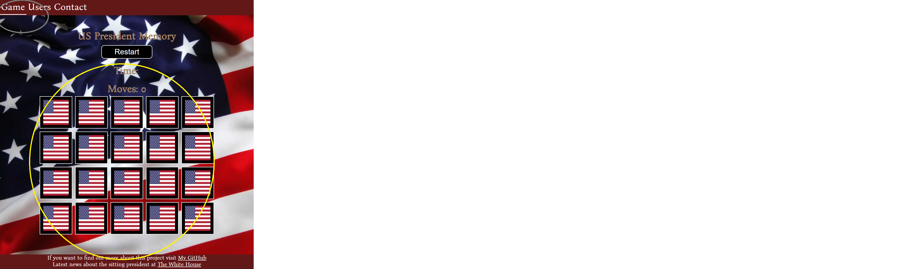

2. As a user I want to be able to see which page I am on.

|                   Feature                       |        Action        |                 Expected result                          |   Actual result     |
|            :----------:                         |    :------------:    |               :-----------------:                        | :---------------:   |
|In the navigation bar a border bottom will show up under the link of the page the user is on.|   None  |  I will see a border under the link of the page I am on.  | Works as expected.  |

Screenshot

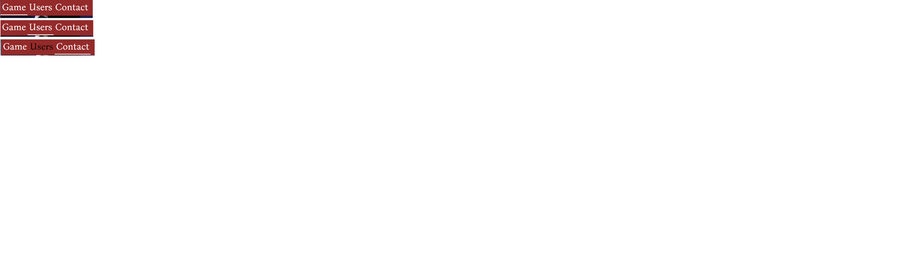

3. As a user I want to be able to play on desktop, tablet and mobile devices.

|                   Feature                       |        Action        |                 Expected result                          |   Actual result     |
|            :----------:                         |    :------------:    |               :-----------------:                        | :---------------:   |
|   Every page has been designed to be responsive.   |        None          |     When on smaller screens The site will work.  | Works as expected.  |

Screenshot

4. As a user I want to challenge my brain.

|                   Feature                       |        Action        |                 Expected result                          |   Actual result     |
|            :----------:                         |    :------------:    |               :-----------------:                        | :---------------:   |
|  The memory game.       | To play the game the user needs to find pairs of presidents and sometimes remember where they saw which president.  |  I will use my memory to find all the presidents. | Works as expected.  |

Screenshot

5. As a user I want to see how much time has passed in real-time while playing.

|                   Feature                       |        Action        |                 Expected result                          |   Actual result     |
|            :----------:                         |    :------------:    |               :-----------------:                        | :---------------:   |
|   The timer is above the game area.            |  Click the cards.       |    When I have clicked two cards the timer will start. | Works as expected.  |

Screenshot

6. As a user I want to be able to see the amount of moves I have made.

|                   Feature                       |        Action        |                 Expected result                          |   Actual result     |
|            :----------:                         |    :------------:    |               :-----------------:                        | :---------------:   |
|   The moves are above the game area             |  Click the cards.    |    When I have clicked two cards the moves will add one. | Works as expected.  |

Screenshot

7. As a user I want to see a pop up modal with time expired and moves made when completing the game.

|                   Feature                       |        Action        |                 Expected result                          |   Actual result     |
|            :----------:                         |    :------------:    |               :-----------------:                        | :---------------:   |
|  A modal with final time, moves made and a close button.    |  Find all pairs.    |  When I finish the game the modal will show up. | Works as expected.  |

Screenshot

8. As a user I want to be able to drop my info for updates.

|                   Feature                       |        Action        |                 Expected result                          |   Actual result     |
|            :----------:                         |    :------------:    |               :-----------------:                        | :---------------:   |
|  A form to drop info to get updates.  | Fill out the form and click submit.   | When I click submit there will be an alert telling the form was submitted. | Works as expected.  |

Screenshot

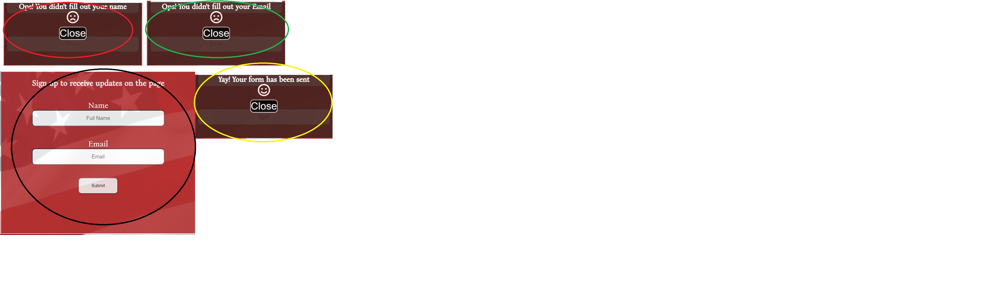

9. As a user I want to see other user who have played the game.

|                   Feature                       |        Action        |                 Expected result                          |   Actual result     |
|            :----------:                         |    :------------:    |               :-----------------:                        | :---------------:   |
|  A page where users can see others who have played the game.   |  Click Users in the navigation bar.   |  When I click Users I will be directed to the users page. | Works as expected.  |

Screenshot

10. As a user I want to know the site owners process making the site.

|                   Feature                       |        Action        |                 Expected result                          |   Actual result     |
|            :----------:                         |    :------------:    |               :-----------------:                        | :---------------:   |
|  Footer information.  |  Scroll down to the footer.   |  When I scroll down I will find the footer with a link to the site owners github. | Works as expected.  |

Screenshot

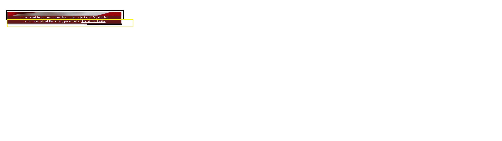

11. As a user I want to see the latest updates from the White House.

|                   Feature                       |        Action        |                 Expected result                          |   Actual result     |
|            :----------:                         |    :------------:    |               :-----------------:                        | :---------------:   |
|  Footer information.  | Scroll down to the footer.  | When I scroll down I will find the footer with a link to the White House. | Works as expected.  |

Screenshot

12. As a user I want a reset button if I want to reset the
game.

|                   Feature                       |        Action        |                 Expected result                          |   Actual result     |
|            :----------:                         |    :------------:    |               :-----------------:                        | :---------------:   |
|  A button to reset the game.                |       Click the button.    |  When I click the button the game will reset.      | Works as expected.  |

Screenshot

13. As a user I want a validation if my form was sent or if there was an error.

|                   Feature                       |        Action        |                 Expected result                          |   Actual result     |
|            :----------:                         |    :------------:    |               :-----------------:                        | :---------------:   |
|   A form validation             |       Fill out the form    |  When one or both of the text areas is empty there will be an alert, if it is filled out correctly there will be an alert.      | Works as expected.  |

Screenshot

## Bugs

* Footer links did not open in a new tab, I added a target_blank to fix it.

* The footer cut some of the content, I gave it a position of absolute and the body, html a position of relative.

* I had white space under my footer, I tried styling with overflow hidden but my desired result came after I inspected my page and removed som margins.

* When I pushed my site live my css and my images did not load, I fixed the filepaths which resolved the issue.

* I had an issue getting the timer to stop in the game, I had to make the game understand *when* the game was over by adding an array to put all the matched cards in and tell it how many cards need to be there and then fire a modal with the clearInterval.

* The form validation only showed name modal so I gave all the modals a unique id in contact.html and form.js.

* The game would keep flipping the cards when the user would press them so js was added to lock the board when two cards were flipped.

* I could not get the 404 page to work, when I launched the site to go live this resolved itself.

* I could not get the username and email from what had been filled out in the form to send with emailjs, code was added in form.js to target form.name.value and respectively for email.

### Known bugs

* When form is filled out correctly it does not send the form on the first click, the form sends on the second click.

* In the game, if i click on card 1 and then card 2 and they are wrong they flip back, now if click on card 1 again it will not flip again. If I on the other hand click on any other card on the grid they will flip. It is just the first card choice and if the cards dont match.

* In the form pop up modals there is a similiar bug as in when the form sends, when the close button is closed the first time is does not respond but the second time it does.

* In the middle stage i had code for the restart game button that worked, but in the congratulations modal it did not. I separated the buttons and had one restart the game with location.reload and the other just to close the modal so the user also could see all the presidents turned on the cards.

## Deployment

* *The site was deployed to github pages.*
1. Log in to Github.
2. In your repository find the settings button and click it.
3. Scroll down to GitHub Pages, beneath it says "Pages settings now has its own dedicated tab! Check it out here!" Click on "Check it out here".
4. Find source.
5. From the drop-down menu select master from branch, click save, let it automatically update.
6. You can now find a live version of the published site under Github pages https://charlie9009.github.io/CI_PP2_UPM/index.html.

### Forking a repository

1. Log in to Github.
2. Find the repository.
3. In the top right corner click the fork button.
4. Now you will have a copy of the repository in your account.

### Cloning a repository
1. Log in to Github.
2. Find the repository.
3. Above the file window locate the green code button and click it.
4. To clone the repository using https copy the link.
5. Open Git bash.
6. Change the current directory to where you want the repository cloned.
7. In your terminal type now type “Git clone” followed by the repository you copied.
8. Press Enter.
9. Done.

## Credit

* The building blocks of the memory game were **heavily** inspired by the following.

    * https://scotch.io/tutorials/how-to-build-a-memory-matching-game-in-javascript
    * https://www.youtube.com/watch?v=ZniVgo8U7ek&t=973s
    * https://www.youtube.com/watch?v=tjyDOHzKN0w&t=382s

* The credit for the functionality for sending the form directly to the site owners email goes to [EmailJS](https://www.emailjs.com/).

* The credit for the content that is fetched in the users page goes to [Regres](https://reqres.in/).

## Media Credit

### Images were googled and added to the project.

## Acknowledgement

* My Mentor Mo has been invaluable, he pushed me to challenge myself and he was able to provide consistent and helpful feedback throughout my project.

* A friend of mine in the business Will, has been able to provide me with help and tips.